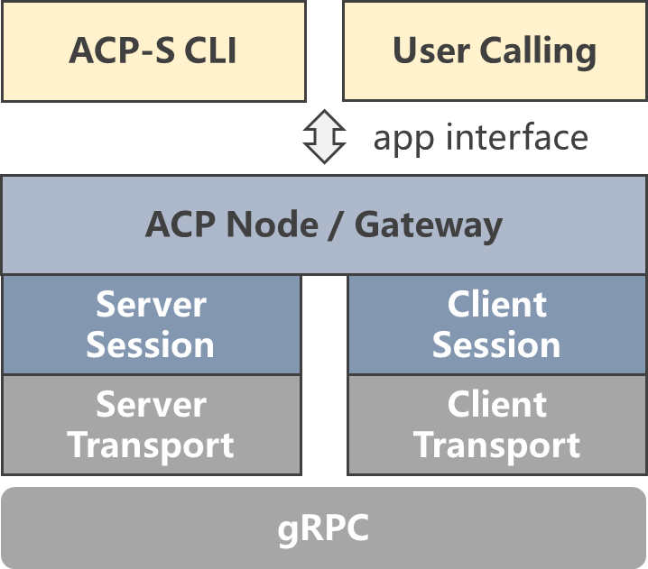

# AIP Python SDK

  <p>
      <a href="README.md">English</a> | <a href="README_zh.md">简体中文</a> 
  </p>

## 📋 简介
**AIP智能体交互协议** (Agent Interaction Protocol) 是中国科学院自动化研究所“AI+科学”研究部开发的分布式智能体交互协议，定义了面向科学场景为代表的多智能体协作、多工具调用、多模态数据访问等通信机制，并提供相关功能组件，支持大规模科学智能体联动场景的快速构建。

### ✨ 特点
- **gRPC通信**：以gRPC作为底层通信框架，以二进制形式传输数据，相比JSON RPC更加轻量，序列化/反序列化速度更快。
- **路由模式**：除常见的点对点通信外，支持以 *网关* 为中心的路由通信模式，便于科学智能体群组管理。
- **统一接口**：同时支持 *智能体-智能体* 双向流式交互和 *智能体-工具/数据* 访问

### 框架示意图
<p align="left"></p>

## 📦 安装
```
git clone https://github.com/ScienceOne-AI/Agent-Interaction-Protocol.git
cd ./Agent-Interaction-Protocol
pip install .
```

## 🚀 快速入门示例

### 1. 运行网关
```python
# run_gateway.py
import asyncio
from atlink_aip.module import Gateway

async def main():
    # 设置网关地址、ID
    gateway = Gateway(address="localhost:50050", gateway_id="test_gw")
    # 启动网关
    await gateway.start()
    print("Gateway started. Press Ctrl+C to exit.")

    try:
        while True:
            await asyncio.sleep(9999999)
    except asyncio.CancelledError:
        print("Stopping gateway...")
        await gateway.stop()

if __name__ == "__main__":
    asyncio.run(main())
```

### 2. 注册工具
```python
import asyncio
from atlink_aip.module import Tool

# 自定义工具函数体
async def calculate_sum(a: int, b: int) -> int:
    """Adds two numbers and returns the sum."""
    return int(a) + int(b)

async def main(gateway_address):
    # 设置工具地址、ID等参数，创建function类工具
    sum_tool = Tool.create_function_tool(
        address="localhost:50062",
        function=calculate_sum,
        name="Sum",
        tool_id="tool2",
        description="A simple tool that adds two numbers"
    )
    # 启动工具
    await sum_tool.start()
    # 注册工具到网关
    await sum_tool.register_to_gateway(gateway_address)
    print("Func Tool registered")

    try:
        while True:
            await asyncio.sleep(9999999)
    except asyncio.CancelledError:
        print("Stopping tools...")
        await sum_tool.stop()

if __name__ == "__main__":
    asyncio.get_event_loop().set_debug(True)
    asyncio.run(main(gateway_address="localhost:50050"))
```

### 3. 注册Agent
```python
import asyncio
import argparse
from functools import partial
from atlink_aip.grpc_service.type import AgentMessage, SessionStatus, Mode
from atlink_aip.module import Agent

# 自定义Agent处理请求函数体
async def delayed_process_request_func(message: AgentMessage, delay: float) -> AgentMessage:
    print(f"\033[33m[RESPONSE] <{message.receiver_id}> --> "
          f"<{message.sender_id}>\033[0m: {message.content[0]._text}")
    await asyncio.sleep(delay)
    text = f"Response to: {message.content[0]._text}"
    return text

async def read_input(prompt: str) -> str:
    return await asyncio.to_thread(input, prompt)

async def interactive_chat_loop(agent: Agent):
    try:
        while True:
            target_id = (await read_input("\nEnter target agent id (or 'exit'): ")).strip()
            if target_id.lower() == "exit":
                exit(0)
            received_id = target_id
            # 创建会话
            session_id = await agent.create_agent_client(received_id)
            text = await read_input("Enter message to send: ")
            text = text.strip()
            # Agent发送请求消息
            await agent.submit_inquiry(
                session_id=session_id,
                receiver_id=received_id,
                content=text
            )
            print(f"\033[31m[SEND] <{agent.agent_id}> --> <{received_id}>\033[0m: {text}")
            # Agent发送会话结束请求
            await agent.submit_inquiry(
                session_id=session_id,
                receiver_id=received_id,
                content="Finish Talk",
                session_status=SessionStatus.STOP_QUEST
            )

            result = ""
            while True:
                # Agent接收反馈消息
                response = await agent.receive_feedback(session_id, received_id)
                print(f"\033[32m[SUCCESS] Response received from <{response.sender_id}>\033[0m")
                if response.session_status == SessionStatus.STOP_RESPONSE:
                    break
                for content_item in response.content:
                    if content_item._text:
                        result += content_item._text
                await asyncio.sleep(1)
            print(f"\033[34m[RESPONSE]\033[0m:{result}")

    except asyncio.CancelledError:
        print("\n\033[34mInput loop cancelled. Exiting...\033[0m")
    except KeyboardInterrupt:
        print("\n\033[34mInterrupted by user. Exiting...\033[0m")

# 请求消息处理逻辑
async def process_server_message(agent):
    while True:
        # 收到请求
        request = await agent.receive_inquiry()
        session_id = request.session_id
        # 设置请求处理
        handlers = [
            partial(delayed_process_request_func, message=request, delay=2)
        ]
        # 处理请求
        results = await agent.invoke_session_handlers(session_id, handlers)
        for text in results:
            # 发送处理结果
            await  agent.submit_feedback(
                session_id=request.session_id,
                receiver_id=request.sender_id,
                request_session_status=request.session_status,
                content=text,
                content_mode=[Mode.TEXT]
            )

async def main(agent_id: str, agent_address: str, gateway_address: str):
    # 设置Agent地址、ID等，创建Agent
    agent = Agent(
        agent_id=agent_id,
        address=agent_address,
        name=f"Agent {agent_id}",
        description="Chatbot agent"
    )
    # 启动Agent
    await agent.start()
    # 注册Agent到网关
    await agent.register_to_gateway(gateway_address)
    # 配置Agent的请求消息处理逻辑
    server_task = asyncio.create_task(process_server_message(agent))

    # 会话任务示例
    client_task = asyncio.create_task(interactive_chat_loop(agent))
    try:
        await asyncio.gather(server_task, client_task)
    finally:
        await agent.stop()
        print(f"\033[35mAgent {agent_id} stopped.\033[0m")


if __name__ == "__main__":
    parser = argparse.ArgumentParser()
    parser.add_argument("--agent_id", type=str, required=True, help="Create an agent ID")
    parser.add_argument("--agent_address", type=str, default="localhost:50051")
    parser.add_argument("--gateway_address", default="localhost:50050")

    args = parser.parse_args()

    asyncio.run(main(agent_id=args.agent_id, agent_address=args.agent_address, gateway_address=args.gateway_address))

```

## 🛠️ 实际应用示例
查看 [`examples/`](./examples) 目录中的实际应用示例

🔖 **案例**: AIP用于小核酸siRNA效力分析

<p align="left"></p>


## ⏳ 未来计划
- [ ] 支持科学数据 Resource 节点
- [ ] 支持动态 WorkFlow 快速搭建
